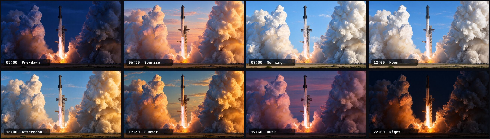
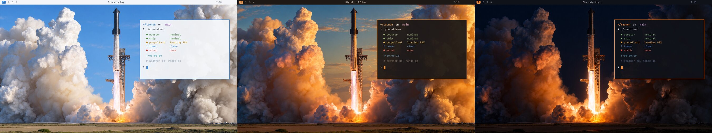

# Starship Dynamic for Omarchy

A Starship launch wallpaper that follows the time of day, with the desktop theme changing to match.

Eight 4K frames go from pre-dawn to night. Three linked Omarchy themes (**Day**, **Golden** and **Night**) change the bar, terminals, borders and the rest of the UI with the light.





## Install

Needs [Omarchy](https://omarchy.org).

```bash
git clone https://github.com/sasukevibes/omarchy-starship-dynamic.git
cd omarchy-starship-dynamic
./install.sh
```

The installer works per user: no sudo and nothing system-wide. It switches you to the Starship theme for the current time straight away. Run `./install.sh --no-apply` to install without changing your theme.

## Schedule

| From  | Frame     | Theme  |
|-------|-----------|--------|
| 05:00 | Pre-dawn  | Night  |
| 06:30 | Sunrise   | Golden |
| 09:00 | Morning   | Day    |
| 12:00 | Noon      | Day    |
| 15:00 | Afternoon | Golden |
| 17:30 | Sunset    | Golden |
| 19:30 | Dusk      | Night  |
| 22:00 | Night     | Night  |

Times use your system's local clock.

## Usage

- **On:** pick any Starship theme with `omarchy theme set starship-day` or the theme picker. It jumps to the theme and frame that match the current time.
- **Off:** pick any other theme. The schedule pauses until you pick a Starship theme again.
- **Preview a stage:** `starship-dynamic preview sunset`. Stages are `predawn`, `sunrise`, `morning`, `noon`, `afternoon`, `sunset`, `dusk` and `night`.
- **Back to schedule:** run `starship-dynamic`.
- **Next frame:** `omarchy theme bg next` cycles through the frames of the current theme.

`starship-dynamic` is installed to `~/.local/bin`. If that folder isn't on your `PATH`, run it as `~/.local/bin/starship-dynamic`.

## How it works

- `themes/`: three ordinary Omarchy themes. Each has its frames in `backgrounds/` and a `colors.toml` sampled from them.
- `bin/starship-dynamic`: picks the theme and frame for the current time. It switches the theme only when the mood changes; otherwise it just swaps the wallpaper.
- `systemd/starship-dynamic.timer`: a user timer that fires only at the eight change times. There's no polling, so it adds nothing noticeable to battery use. A change missed while the machine was off or asleep runs as soon as it's back, and the timer never wakes the machine.
- `hooks/`: Omarchy hooks that catch up at login (`post-boot`) and when a Starship theme is picked (`theme-set`).

To change the times, edit `OnCalendar=` in `systemd/starship-dynamic.timer` and the matching times in `bin/starship-dynamic`, then run `./install.sh` again.

## Uninstall

```bash
./uninstall.sh
```

Then pick another theme with `omarchy theme set <name>`.

## License

Code is MIT licensed. See [LICENSE](LICENSE). Not affiliated with SpaceX.
